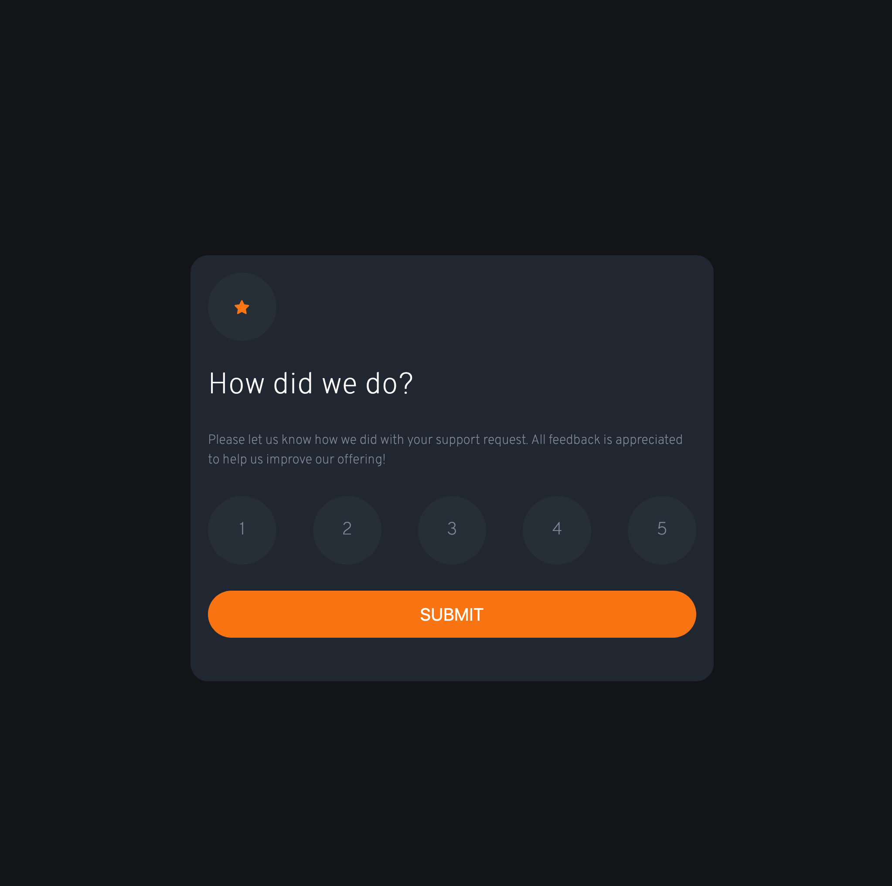

# Frontend Mentor - Interactive rating component solution

This is a solution to the [Interactive rating component challenge on Frontend Mentor](https://www.frontendmentor.io/challenges/interactive-rating-component-koxpeBUmI). 

## Table of contents

- [Overview](#overview)
  - [The challenge](#the-challenge)
  - [Screenshot](#screenshot)
  - [Links](#links)
- [My process](#my-process)
  - [Built with](#built-with)
  - [What I learned](#what-i-learned)
  - [Continued development](#continued-development)
- [Author](#author)


## Overview

### The challenge

Users should be able to:

- View the optimal layout for the app depending on their device's screen size
- See hover states for all interactive elements on the page
- Select and submit a number rating
- See the "Thank you" card state after submitting a rating

### Screenshot




### Links

- Solution URL: [Add solution URL here](https://your-solution-url.com)
- Live Site URL: [Add live site URL here](https://your-live-site-url.com)

## My process

### Built with

- Semantic HTML5 markup
- CSS custom properties
- Flexbox
- CSS Grid
- Mobile-first workflow

### What I learned
The challenge allowed me build my skill on structuring a page, and applying CSS to the structure. I was able to work on both grids and flexbox for this fun challenge. The javascript aspect was also interesting as it made me look at various scenerios users would attempt with the rating page. One aspect I thought of was allowing the user unselect a rating.


``` js 
    // A sample of a scenerio
    if (!ratingScore)
    {
        alert("Select a Rating please!")
        return ;
    }
```

### Continued development
- CSS variables is definitely an area I would want to improve on. 


## Author

- Website - [Add your name here](https://www.your-site.com)
- Frontend Mentor - [@yourusername](https://www.frontendmentor.io/profile/yourusername)

**Note: Delete this note and add/remove/edit lines above based on what links you'd like to share.**

